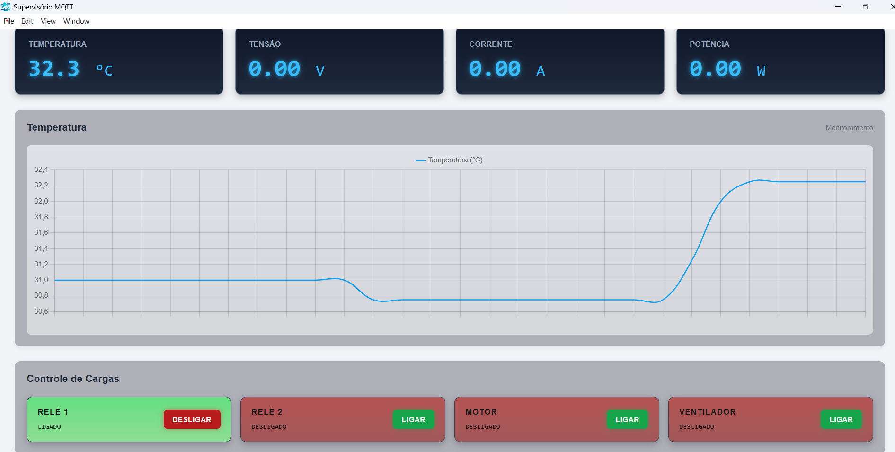
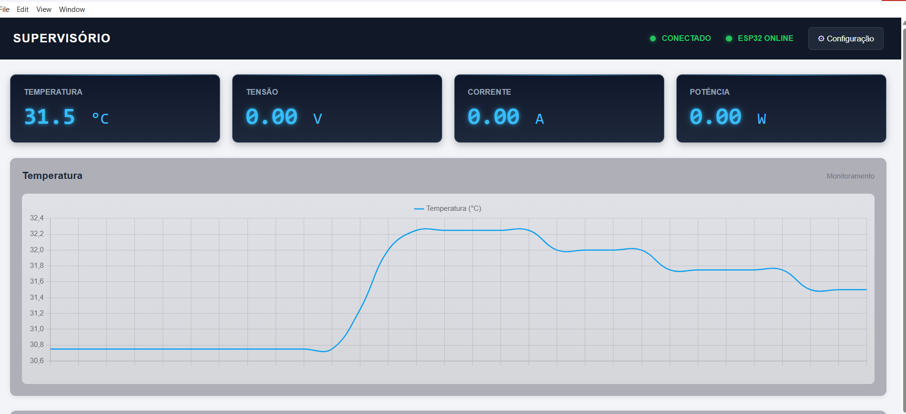

# 🚀 Supervisório IoT — ESP32 + MQTT + Electron.js
<p align="center">   </p>
<p align="center">   </p>

Aplicação supervisória desktop desenvolvida para monitoramento e controle de um dispositivo ESP32 por meio do protocolo MQTT e do broker HiveMQ Cloud.

O projeto foi desenvolvido como uma aplicação prática de **IoT, sistemas embarcados, comunicação MQTT e supervisão**, permitindo visualizar dados enviados pelo ESP32 e realizar o acionamento de cargas diretamente pela interface gráfica.

## 📌 Sobre o projeto

O supervisório estabelece uma comunicação bidirecional entre o aplicativo desktop e o ESP32.

O ESP32 realiza a aquisição e publicação dos dados através do MQTT, enquanto o aplicativo desenvolvido em Electron.js recebe essas informações, apresenta os valores na interface e permite enviar comandos para acionamento das cargas.

### Arquitetura do sistema

```text
┌──────────────────────┐
│        ESP32         │
│                      │
│ • Temperatura        │
│ • Tensão             │
│ • Corrente           │
│ • Potência           │
│ • Estado das cargas  │
└──────────┬───────────┘
           │
           │ MQTT
           ▼
┌──────────────────────┐
│    HiveMQ Cloud      │
│    MQTT Broker       │
└──────────┬───────────┘
           │
           │ MQTT / TLS
           ▼
┌──────────────────────┐
│   Electron.js        │
│                      │
│ • Monitoramento      │
│ • Controle           │
│ • Status ESP32       │
│ • Gráficos           │
└──────────────────────┘
```

## ⚙️ Tecnologias utilizadas

* **ESP32**
* **Electron.js**
* **JavaScript**
* **Node.js**
* **MQTT**
* **HiveMQ Cloud**
* **HTML5**
* **CSS3**
* **Chart.js**
* **electron-builder**

## 📊 Monitoramento

O sistema foi estruturado para receber e apresentar diferentes grandezas e informações provenientes do ESP32:

* 🌡️ Temperatura
* ⚡ Tensão
* 🔌 Corrente
* ⚡ Potência
* 📡 Status de conexão do ESP32
* 🔄 Estado das cargas

Os valores são recebidos dinamicamente através de tópicos MQTT.

## 🎛️ Controle de cargas

O supervisório permite o acionamento independente de quatro cargas:

* Relé 1
* Relé 2
* Motor
* Ventilador

O comando é enviado pelo aplicativo através do MQTT e o ESP32 realiza o acionamento correspondente.

Além do envio do comando, o estado de cada carga é publicado pelo ESP32 e apresentado no supervisório.

## 📡 Comunicação MQTT

O projeto utiliza uma estrutura de tópicos organizada por dispositivo.

Exemplo:

```text
supervisorio/esp32-001/
```

### Principais tópicos

```text
supervisorio/esp32-001/status
supervisorio/esp32-001/temperatura
supervisorio/esp32-001/tensao
supervisorio/esp32-001/corrente
supervisorio/esp32-001/potencia
```

### Estados das cargas

```text
supervisorio/esp32-001/rele1/state
supervisorio/esp32-001/rele2/state
supervisorio/esp32-001/motor/state
supervisorio/esp32-001/ventilador/state
```

### Comandos

```text
supervisorio/esp32-001/rele1/cmd
supervisorio/esp32-001/rele2/cmd
supervisorio/esp32-001/motor/cmd
supervisorio/esp32-001/ventilador/cmd
```

## 🔐 Segurança da comunicação

A comunicação com o HiveMQ Cloud utiliza conexão MQTT sobre TLS.

As credenciais do broker não devem ser armazenadas diretamente no código-fonte ou publicadas no GitHub.

Para executar o projeto, configure as credenciais do seu próprio broker MQTT.

## 🖥️ Interface

A interface foi desenvolvida como uma aplicação desktop utilizando Electron.js.

O supervisório possui:

* Barra superior com status da conexão MQTT;
* Status de conexão do ESP32;
* Cards para apresentação das grandezas;
* Gráfico de temperatura;
* Controle individual das cargas;
* Indicação visual do estado dos equipamentos;
* Tela de configuração da conexão MQTT.

## 📁 Estrutura do projeto

```text
SupervisorioWEB/
│
├── index.js
├── preload.js
├── index.html
├── app.js
├── style.css
├── package.json
├── capa.ico
├── icone.png
├── .gitignore
└── README.md
```

## ▶️ Como executar

### Pré-requisitos

Instale:

* Node.js
* npm
* Arduino IDE ou ambiente equivalente para programação do ESP32
* Conta/configuração de um broker MQTT, como HiveMQ Cloud

### Instalar dependências

Dentro da pasta do projeto:

```bash
npm install
```

### Executar em modo desenvolvimento

```bash
npm start
```

## 📦 Gerar o executável

O projeto utiliza o `electron-builder` para geração do aplicativo para Windows.

Para gerar o executável portátil:

```bash
npx electron-builder --win portable --x64
```

O arquivo gerado será disponibilizado na pasta:

```text
dist/
```

O executável portátil pode ser utilizado sem a necessidade de instalação tradicional.

## 🔌 ESP32

O ESP32 é responsável pela comunicação com o broker MQTT, aquisição das informações e controle das cargas.

Entre suas funções estão:

* Conexão à rede Wi-Fi;
* Conexão segura ao HiveMQ Cloud;
* Publicação das grandezas;
* Publicação do status do dispositivo;
* Recepção dos comandos MQTT;
* Acionamento das cargas;
* Publicação do estado das cargas.

O sistema também utiliza publicação de status `online/offline` para indicar a disponibilidade do ESP32.

## 🚧 Próximas melhorias

O projeto continua em desenvolvimento e poderá receber novas funcionalidades, como:

* 📄 Exportação de relatórios em PDF;
* 📈 Ampliação dos gráficos;
* 📊 Histórico de dados;
* 🗄️ Armazenamento de dados;
* 👥 Gerenciamento de múltiplos ESP32;
* 🔔 Sistema de alarmes;
* ⚙️ Configurações adicionais de supervisão;
* 📱 Interface para monitoramento remoto.

## 🎯 Objetivo

O objetivo do projeto é desenvolver uma solução de supervisão e controle baseada em IoT, utilizando tecnologias de comunicação e desenvolvimento atualmente aplicadas em sistemas industriais e de automação.

Além de servir como aplicação prática de **ESP32, MQTT e Electron.js**, o projeto também busca explorar conceitos de **monitoramento, controle, comunicação de dados e sistemas supervisórios**.

## 👨‍💻 Autor

**Silas Almeida**

Projeto desenvolvido para estudo e aplicação prática de tecnologias relacionadas a:

* Engenharia Elétrica
* IoT
* Automação
* Sistemas embarcados
* Programação
* Comunicação MQTT
* Supervisão e controle

---

⭐ Se este projeto foi útil ou interessante, considere deixar uma estrela no repositório.
